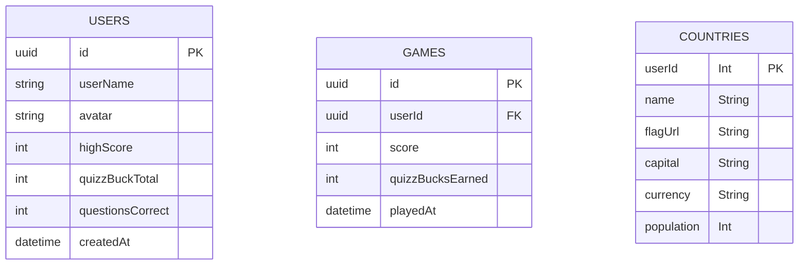

# exQuizzit

exQuizzit is a modern, space-themed quiz application built with [Next.js](https://nextjs.org), Supabase, and Prisma. It features animated UI, robust database integration, and a clean separation of concerns for maintainability and scalability.

---

## Table of Contents

- [Project Structure](#project-structure)
- [Getting Started](#getting-started)
- [Environment Variables](#environment-variables)
- [Database Setup](#database-setup)
- [Development Workflow](#development-workflow)
- [Testing](#testing)
- [Key Features](#key-features)
- [API & Services](#api--services)
- [Deployment](#deployment)
- [Troubleshooting](#troubleshooting)

---

## Project Structure

See [`PROJECT_STRUCTURE.txt`](PROJECT_STRUCTURE.txt) for full details.

**Root Files:**

- `.env`, `.env.test` – Environment variables for dev and test
- `package.json` – Scripts and dependencies
- `tsconfig.json`, `next.config.ts`, `postcss.config.mjs`, `eslint.config.mjs` – Configuration files
- `README.md`, `SETUP.md` – Documentation and setup instructions
- `clearDb.ts`, `seed.ts` – Database utilities

**Directories:**

- `src/` – Main application code
  - `app/` – Next.js App Router, pages, API routes
  - `components/` – Reusable React components (QuizClient, EarthAnimation, etc.)
  - `lib/` – Shared utilities (Supabase client, Prisma config)
  - `services/` – Business logic (CountryService, QuestionService, TriviaService)
  - `utils/` – Utility functions (decodeHTML, shuffleArray)
  - `data/` – Static and test data
- `prisma/` – Database schema, migrations, seed scripts
- `generated/` – Generated Prisma client files
- `public/` – Static assets

**Testing:**

- `__tests__/` – Jest test suites for DB and utilities

---

## Getting Started

1. **Install dependencies:**

   ```bash
   npm install
   ```

2. **Set up environment variables:**

   - Copy `.env.example` to `.env` and fill in your Supabase credentials and database URL.
   - Example:
     ```
     DATABASE_URL="postgresql://<user>:<password>@<host>:5432/<db>"
     NEXT_PUBLIC_SUPABASE_URL=https://<project>.supabase.co
     NEXT_PUBLIC_SUPABASE_ANON_KEY=<anon-key>
     ```

3. **Generate Prisma client:**

   ```bash
   npx prisma generate
   ```

4. **Start development server:**
   ```bash
   npm run dev
   ```

See [`SETUP.md`](SETUP.md) for more details.

---

## Environment Variables

- `DATABASE_URL` – Supabase Postgres connection string
- `NEXT_PUBLIC_SUPABASE_URL` – Supabase project URL
- `NEXT_PUBLIC_SUPABASE_ANON_KEY` – Supabase anon key

---

## Database Setup

- **Supabase** is used for both database and authentication.
- Tables are pre-created and migrated.
- **Seeding:** Run `npm run seed` to populate the database.
- **Test DB:** Use `.env.test` and scripts like `npm run test:db:push` for test database setup.

See [`prisma/schema.prisma`](prisma/schema.prisma) for schema details.

**Entity Relationship Diagram (ERD):**



---

## Development Workflow

- `npm run dev` – Start dev server
- `npm run build` – Build for production
- `npm test` – Run Jest tests
- `npx prisma db push` – Update DB schema
- `npx prisma generate` – Generate Prisma client
- `npm run seed` – Seed database

---

## Testing

- **Jest** is used for unit and integration tests.
- Test suites are in [`__tests__/`](__tests__/).
- Use test DB scripts for isolated test environments.

---

## Key Features

- **Frontend:** Next.js 13+ App Router, React components, Tailwind CSS, animated globe, timer bar, QuizzBucks display.
- **Backend:** RESTful API routes, Prisma ORM, Supabase integration, service layer architecture.
- **Quiz Logic:** Mixed flag and trivia questions, "Did You Know" facts, timer bar, immediate feedback, leaderboard.
- **Visuals:** Space theme, animated globe, custom scrollbars, responsive design.

---

## API & Services

- **API Routes:** Located in `src/app/api/`

  - `/countries` – Country data
  - `/games` – Game records
  - `/quiz/questions` – Quiz question generation
  - `/trivia` – External trivia API
  - `/users` – User management
  - `/users/username` – get user by username
  - `login` - Stores user session and basic authentication
  - `logout` - Clears cookies from user session

- **Services:** Encapsulate business logic (see `src/services/`)

---

## Deployment

- Environment-based configuration for production and development.
- See Next.js and Supabase docs for deployment steps.

---

## Troubleshooting

- **Prisma errors:** Run `npx prisma generate`
- **Connection errors:** Check `.env` file
- **Database issues:** Use Supabase dashboard

---

## Additional Notes

- See [`PROJECT_STRUCTURE.txt`](PROJECT_STRUCTURE.txt) for a full breakdown of files and architecture.
- For API/service details, see comments in source files and [`README.md`](README.md).

---

Created by Behnoud Halalipour, Jake Daniels, Brad Mattison and Joel Kram

## License

MIT
